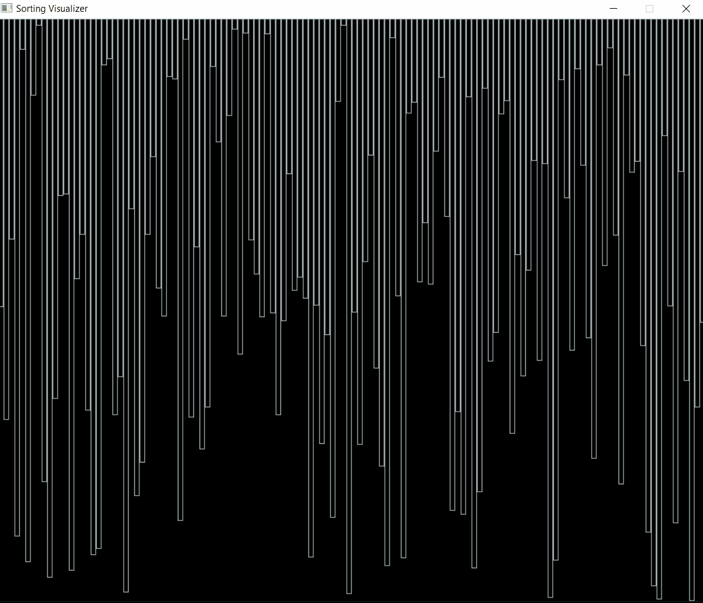

# Sorting Visualizer

Visualization of different sorting algorithms in C++ with SDL2 Library.

A sorting algorithm is an algorithm that puts the elements of a list in a certain order. While there are a large number of sorting algorithms, in practical implementations a few algorithms predominate.
In this implementation of sorting visualizer, we'll be looking at some of these sorting algorithms and visually comprehend their working.
The sorting algorithms covered here are Selection Sort, Insertion Sort, Bubble Sort, Merge Sort, Quick Sort and Heap Sort.
The list size is fixed to 130 elements. You can randomize the list and select any type of sorting algorithm to call on the list from the given options. Here, all sorting algorithms will sort the elements in ascending order. The sorting time being visualized for an algorithm is not exactly same as their actual time complexities. The relatively faster algorithms like Merge Sort, etc. have been delayed so that they could be properly visualized.

# How to run:-

Option 1.) You can run Sorting Visualizer directly from the release. Download the release and run the .exe application i.e., Sorting Visualizer.exe -> [Download](https://github.com/YoganshWagh/Sorting-Visualizer/ZIP)

Option 2.) You can also run Sorting Visualizer using the C++ source code available in the repository i.e., Sorting Visualizer.cpp but you will need to install and setup the SDL2 library first. I recommend you follow Lazy Foo' Productions' tutorial to setup SDL2 Library. PLEASE NOTE THAT the tutorial follows to setup SDL2 32-bit library but to run Sorting Visualizer, you have to use the 64-bit library. Just use x86_64-w64-mingw32 folder instead of i686-w64-mingw32 to setup the SDL2 files.-> [How to download and setup SDL2 library](http://lazyfoo.net/tutorials/SDL/01_hello_SDL/index.php).
After setting up the SDL2 library, just include the Sorting Visualizer.cpp file from the repository in your project with the build options as mentioned in the tutorial and build and run the project.

# Controls:-

WARNING: Giving repetitive commands may cause latency and the visualizer may behave unexpectedly. Please give a new command only after the current command's execution is done.

Available Controls inside Sorting Visualizer:-
- Use 0 to Generate a different randomized list.
- Use 1 to start Selection Sort Algorithm.
- Use 2 to start Insertion Sort Algorithm.
- Use 3 to start Bubble Sort Algorithm.
- Use 4 to start Merge Sort Algorithm.
- Use 5 to start Quick Sort Algorithm.
- Use 6 to start Heap Sort Algorithm.
- Use q to exit out of Sorting Visualizer

# Samples

- Sample 1 (Insertion Sort)

- Sample 2 (Merge Sort)

